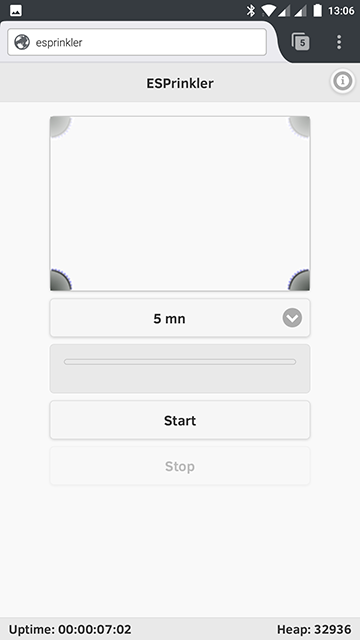
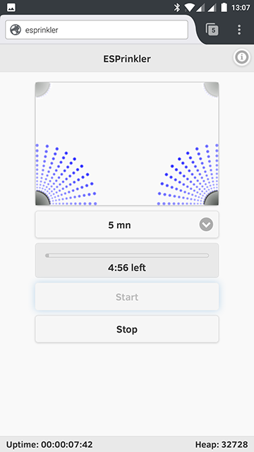
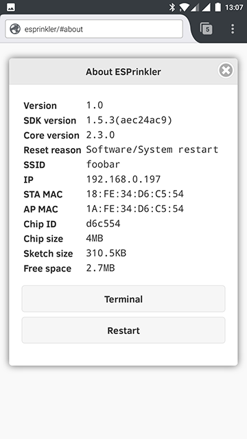
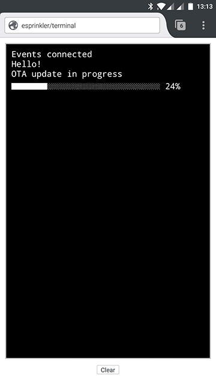

# ESPrinkler

Remote control up to 4 solenoid valves with the ESP8266 SOC (Arduino environment).

Either use the integrated web app with your smartphone (point your browser at `http://esprinkler.local`) or let your favorite scheduler send HTTP commands to trigger sprinklers.

At the end of a sprinkling cycle, meaningfull information are published on your MQTT server: which sprinklers were activated, how long did they sprinkle, ESP uptime & heap...).

ESPrinkler can easily be adapted to control different/more devices.  

## Screen captures

### Main screen
1. Select any or all of the 4 sprinklers by clicking corners
2. Select the sprinkling duration with the drop-down list
3. Press `Start` button
4. Let the cycle complete or press `Stop` button to abort

 

[Server events](https://developer.mozilla.org/en-US/docs/Web/API/Server-sent_events) are used to keep this screen in sync with the ESP8266 (active sprinklers, uptime, timer, heap...).  
It means you won't get lost if you close your browser during a sprinkling cycle, and open it later in the cycle, or even open another browser from another device.

### About screen

This screen contains some infos about the ESP8266, and two command buttons.
1. `Terminal`: press it to display the Terminal screen (see bellow)
2. `Restart`: press it if you feel like restarting the ESP8266 

### Terminal screen

This screen is intended to display specific [server events](https://developer.mozilla.org/en-US/docs/Web/API/Server-sent_events).  
For the moment, only OTA related events are displayed.

## Direct HTTP commands

Activate all 4 sprinklers for 1 minute:  
`http://esprinkler.local/start?pins=1111&duration=60`  

Activate sprinklers 1 and 4 for 5 minutes:  
`http://esprinkler.local/start?pins=1001&duration=300`
  
Abort current sprinkling cycle:  
`http://esprinkler.local/stop`

## Dependencies

- [ESP8266 Arduino Core](https://github.com/esp8266/Arduino)
- [ESPAsyncWebServer library](https://github.com/me-no-dev/ESPAsyncWebServer)

## Licence

This is free and unencumbered software released into the public domain.

Anyone is free to copy, modify, publish, use, compile, sell, or
distribute this software, either in source code form or as a compiled
binary, for any purpose, commercial or non-commercial, and by any
means.

In jurisdictions that recognize copyright laws, the author or authors
of this software dedicate any and all copyright interest in the
software to the public domain. We make this dedication for the benefit
of the public at large and to the detriment of our heirs and
successors. We intend this dedication to be an overt act of
relinquishment in perpetuity of all present and future rights to this
software under copyright law.

THE SOFTWARE IS PROVIDED "AS IS", WITHOUT WARRANTY OF ANY KIND,
EXPRESS OR IMPLIED, INCLUDING BUT NOT LIMITED TO THE WARRANTIES OF
MERCHANTABILITY, FITNESS FOR A PARTICULAR PURPOSE AND NONINFRINGEMENT.
IN NO EVENT SHALL THE AUTHORS BE LIABLE FOR ANY CLAIM, DAMAGES OR
OTHER LIABILITY, WHETHER IN AN ACTION OF CONTRACT, TORT OR OTHERWISE,
ARISING FROM, OUT OF OR IN CONNECTION WITH THE SOFTWARE OR THE USE OR
OTHER DEALINGS IN THE SOFTWARE.

For more information, please refer to <http://unlicense.org>
